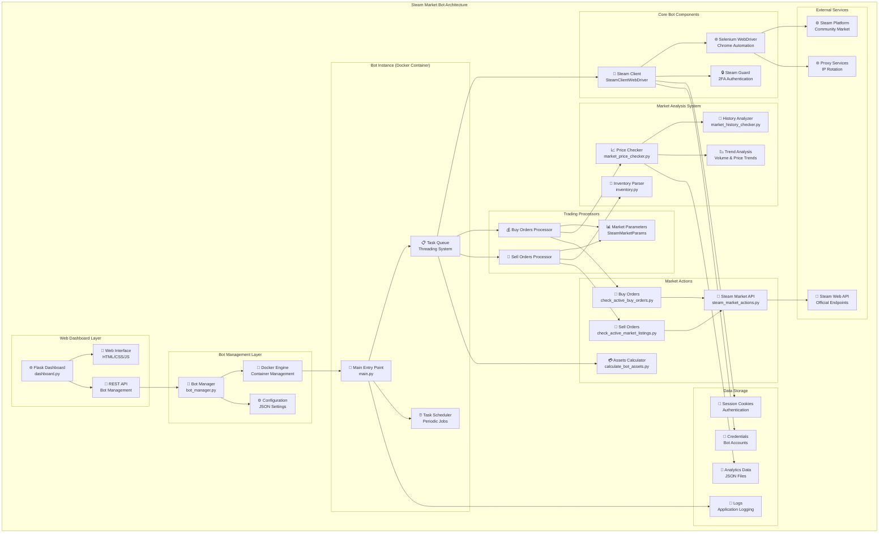

# Steam Market Bot - Автоматизированная торговая система

## Обзор проекта

**Steam Market Bot** - это комплексная автоматизированная система для торговли предметами на Steam Community Market. Проект представляет собой многобот-архитектуру с веб-панелью управления, реализованную на Python с использованием Docker для контейнеризации.

## Ключевые технологии и навыки

### Технический стек
- **Backend**: Python 3.9+, Flask, SQLite
- **Frontend**: HTML5, CSS3, JavaScript, Bootstrap
- **Автоматизация**: Selenium WebDriver, Undetected Chrome
- **Контейнеризация**: Docker, Docker Compose
- **API**: Steam Web API, собственные REST API
- **Парсинг**: BeautifulSoup4, requests
- **Аутентификация**: Steam Guard (TOTP), двухфакторная аутентификация

### Архитектурные решения
- **Контейнеризованная архитектура** с изоляцией ботов через Docker
- **Многопоточность** для параллельной обработки задач
- **Очереди задач** с семафорами для синхронизации
- **Централизованное логирование** с ротацией и уровнями
- **Конфигурационное управление** через JSON и переменные окружения
- **Устойчивость к сбоям** с retry-механизмами и graceful recovery

## Основная функциональность

### 1. Автоматизированная торговля
- **Анализ рынка**: Автоматический анализ цен, трендов и объемов торгов
- **Создание ордеров**: Автоматическое размещение ордеров на покупку и продажу
- **Управление инвентарем**: Автоматическое выставление предметов на продажу
- **Подтверждение сделок**: Автоматическое подтверждение через Steam Guard

### 2. Интеллектуальные алгоритмы
- **Анализ прибыльности**: Расчет потенциальной прибыли с учетом комиссий
- **Трендовый анализ**: Определение направления движения цен
- **Объемный анализ**: Проверка ликвидности рынка
- **Редкие предметы**: Определение предметов с редкими характеристиками (float, стикеры)

### 3. Веб-панель управления
- **Мониторинг ботов**: Реальная статистика работы ботов
- **Управление конфигурацией**: Настройка параметров торговли
- **Логирование**: Просмотр логов в реальном времени
- **Статистика**: Аналитика по прибыли и активности

## Детальная архитектура

### Ядро системы (Core)

#### main.py - Точка входа
```python
# Система очередей задач с семафорами для синхронизации
class TaskQueue:
    - Thread-safe управление задачами через queue.Queue()
    - Семафоры для контроля конкурентного доступа
    - Планировщик задач с настраиваемыми интервалами
    - Обработка исключений и автоматическое восстановление
    - Предотвращение дублирования задач через множества
```

**Периодические задачи:**
- Подсчет активов (каждые 2 часа)
- Проверка активных листингов (каждые 12 часов)
- Создание ордеров на продажу (каждый час)
- Проверка ордеров на покупку (каждые 12 часов)
- Создание ордеров на покупку (каждые 12 часов)

#### bot_manager.py - Менеджер ботов
```python
class BotManager:
    - Управление Docker-контейнерами ботов
    - Динамическое создание/удаление ботов
    - Мониторинг состояния ботов
    - Управление ресурсами (память, CPU)
```

### Модули инициализации (initBot/)

#### SteamClientWebDriver.py
- **Браузерная автоматизация**: Undetected Chrome для обхода защиты
- **Аутентификация**: Steam Guard 2FA с TOTP-кодами
- **Сессионное управление**: Персистентные cookies и проверка состояния
- **Прокси поддержка**: Динамическое форматирование и ротация прокси
- **Устойчивость**: Retry-логика для сетевых операций и JavaScript-ошибок

#### SteamMarketParams.py
- **Конфигурационная система**: 60+ настраиваемых параметров
- **Торговые стратегии**: Настройки прибыльности и рисков
- **Фильтры предметов**: Ценовые диапазоны и категории

### Процессоры торговых операций

#### buy_orders_processor.py
```python
def buy_orders_processor():
    - Анализ предметов для покупки
    - Расчет оптимальных цен покупки
    - Создание и размещение buy-ордеров
    - Проверка лимитов баланса и рисков
    - Валидация торговых условий
```

#### sell_orders_processor.py
```python
def sell_orders_processor():
    - Парсинг и анализ инвентаря
    - Определение оптимальных цен продажи
    - Создание листингов предметов
    - Обработка редких предметов (float, стикеры)
    - Автоматическое подтверждение листингов
```

### Система анализа (parsers/)

#### market_price_checker.py
- **Ценовой анализ**: Получение актуальных цен
- **Гистограммы ордеров**: Анализ спроса и предложения
- **Трендовый анализ**: Определение направления цен
- **Объемный анализ**: Проверка торговой активности

#### inventory.py
- **Парсинг инвентаря**: Получение списка предметов
- **Анализ float values**: Определение износа предметов
- **Стикер анализ**: Оценка дополнительной стоимости

### Торговые действия (marketActions/)

#### steam_market_actions.py
- **API интеграция**: Работа с Steam Web API
- **Создание ордеров**: Размещение buy/sell ордеров
- **Обработка ошибок**: Retry логика и восстановление

### Панель управления (dashboard/)

#### dashboard.py (Flask приложение)
```python
# REST API endpoints:
- /api/bots - Управление ботами
- /api/logs - Получение логов
- /api/stats - Статистика торговли
- /api/settings - Настройки системы
```

**Веб-интерфейс:**
- Адаптивный дизайн
- Real-time обновления
- Графики и метрики
- Управление конфигурацией

## Сложные технические решения

### 1. Обход антибот-защиты
```python
# Undetected Chrome + рандомизация поведения
def random_sleep(min_sleep=1, max_sleep=3):
    time.sleep(random.uniform(min_sleep, max_sleep))
    # Имитация человеческих интервалов между действиями

# Настройки браузера для обхода детекции
chrome_options.add_argument("--disable-blink-features=AutomationControlled")
chrome_options.add_experimental_option("excludeSwitches", ["enable-automation"])
```

### 2. Система подтверждений транзакций
```python
# Интеграция с Steam Guard для автоподтверждения
class TradeConfirmationService:
    def confirm_sell_listings(self):
        # Автоматическое подтверждение листингов через Steam API
        # Использование shared_secret и identity_secret
        
    def send_rare_items_trade(self, items, trade_link):
        # Отправка редких предметов через трейд-офферы
```

### 3. Обработка ошибок и восстановление
```python
# Многоуровневая система обработки ошибок
def handle_javascript_error(self, actual_url):
    print("JavaScript error detected, retrying...")
    self.driver.get(actual_url)
    custom_sleep.random_sleep()
    self.auth_check(actual_url=actual_url)

# Автоматическое восстановление после сбоев
if "session deleted because of page crash" in str(e):
    steam_client = SteamClientWebDriver()  # Пересоздание клиента
```

### 4. Контейнеризованная многобот-архитектура
```yaml
# Docker-based изоляция и управление ботами
services:
  dashboard:
    build: ./dashboard
    ports: ["5000:5000"]
    volumes:
      - /var/run/docker.sock:/var/run/docker.sock  # Управление контейнерами
      
  bot_instance:
    build: .
    environment:
      - BOT_ID=${BOT_ID}  # Динамическая конфигурация
    volumes:
      - ./logs:/app/logs              # Персистентные логи
      - ./credentials:/app/credentials # Безопасное хранение данных
    restart: unless-stopped
```

## Масштабируемость и производительность

### Оптимизации
- **Конкурентность**: Многопоточная обработка задач
- **Кэширование**: Локальное кэширование данных о предметах
- **Batch операции**: Групповая обработка запросов
- **Ресурс-менеджмент**: Контроль использования памяти и CPU

### Мониторинг
- **Метрики производительности**: Время выполнения операций
- **Статистика ошибок**: Tracking исключений и retry
- **Финансовая аналитика**: Отслеживание прибыли/убытков

## DevOps и развертывание

### Docker интеграция и оркестрация
```yaml
# docker-compose.yml - Полная конфигурация
services:
  dashboard:
    build: 
      context: ./dashboard
      dockerfile: Dockerfile
    container_name: steam_market_bot_dashboard
    ports: ["5000:5000"]
    volumes:
      - /var/run/docker.sock:/var/run/docker.sock  # Docker API доступ
      - ./logs:/app/logs
      - ./credentials:/app/credentials
    networks: [steam_bot_network]
    restart: unless-stopped
  
  bot_example:
    build:
      context: .
      dockerfile: Dockerfile.optimized
    volumes:
      - ./logs:/app/logs
      - ./cookies:/app/cookies
      - ./analytics:/app/analytics
      - ./credentials:/app/credentials
    environment:
      - BOT_ID=example_bot
    shm_size: 1gb  # Для Chrome WebDriver
    restart: unless-stopped
```

### CI/CD возможности
- Автоматизированная сборка образов
- Конфигурационное управление
- Логирование и мониторинг
- Backup и восстановление данных

## Бизнес-логика

### Торговые стратегии
1. **Арбитраж**: Поиск ценовых несоответствий
2. **Скальпинг**: Быстрые сделки на малых движениях
3. **Тренд-следование**: Торговля по направлению рынка
4. **Редкие предметы**: Специализированная торговля

### Риск-менеджмент
- Лимиты на сумму ордеров
- Максимальное время удержания позиций
- Автоматическая остановка при убытках
- Диверсификация по предметам

## Заключение

Этот проект демонстрирует:
- **Полноценную разработку**: От концепции до production deployment
- **Системное мышление**: Архитектурные решения для высоконагруженной системы
- **Техническую экспертизу**: Интеграция веб-скрапинга, API, контейнеризации и алгоритмической торговли
- **DevOps практики**: Docker оркестрация, мониторинг, логирование
- **Обработка краевых случаев**: Retry-логика, graceful degradation, error recovery
- **Практическую ценность**: Реальное решение для автоматизации торговли

**Технические достижения:**
- Обработка тысяч предметов ежедневно с анализом рыночных данных
- Управление множественными Steam аккаунтами через изолированные контейнеры  
- Автоматизированная прибыль через алгоритмическую торговлю
- Обход антибот-систем Steam через продвинутые техники веб-автоматизации
- Fault-tolerant архитектура с автоматическим восстановлением после сбоев

## Диаграмма архитектуры системы



### Описание архитектуры

**Слои системы:**

1. **Web Dashboard Layer** - Веб-интерфейс управления ботами
2. **Bot Management Layer** - Система управления Docker-контейнерами
3. **Bot Instance** - Отдельный экземпляр бота в контейнере
4. **Core Bot Components** - Ядро автоматизации Steam
5. **Trading Processors** - Процессоры торговых операций
6. **Market Analysis System** - Система анализа рынка
7. **Market Actions** - Выполнение торговых операций
8. **External Services** - Внешние сервисы Steam
9. **Data Storage** - Система хранения данных

**Поток данных:**
- Веб-панель управляет конфигурацией ботов через Docker
- Каждый бот работает независимо в своем контейнере
- Система задач координирует все торговые операции
- Анализ рынка предоставляет данные для принятия решений
- Торговые действия выполняются через Steam API и веб-интерфейс
